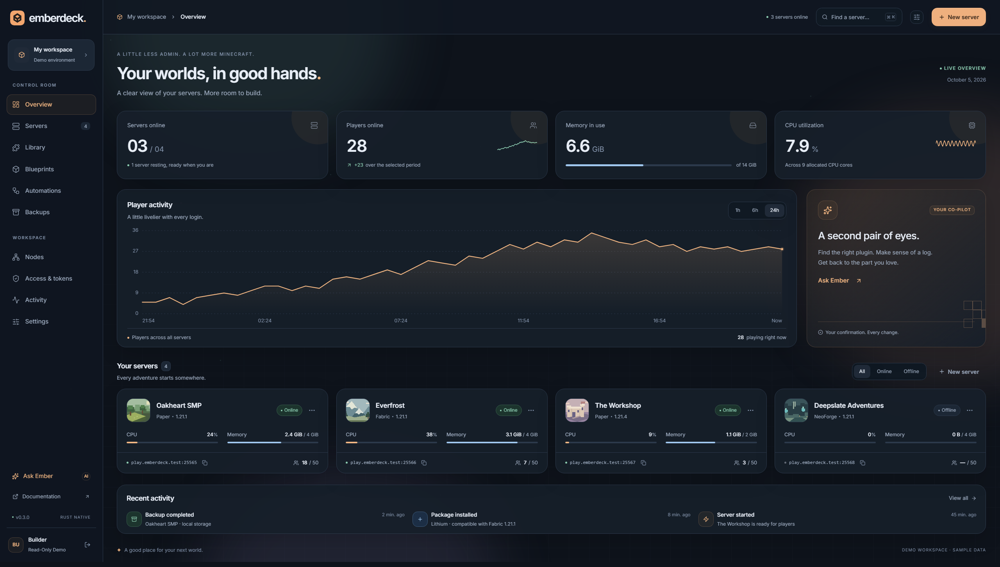
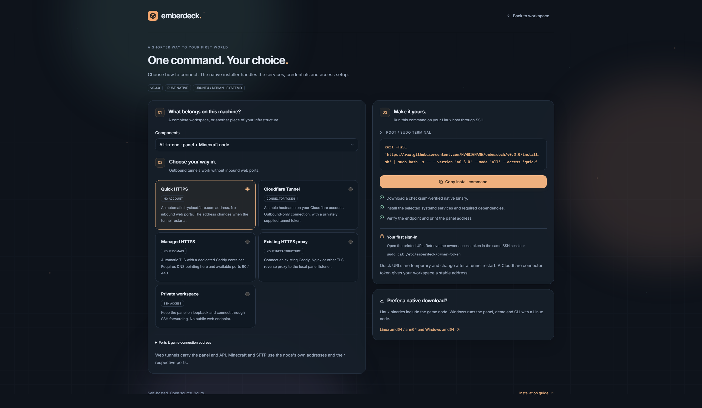
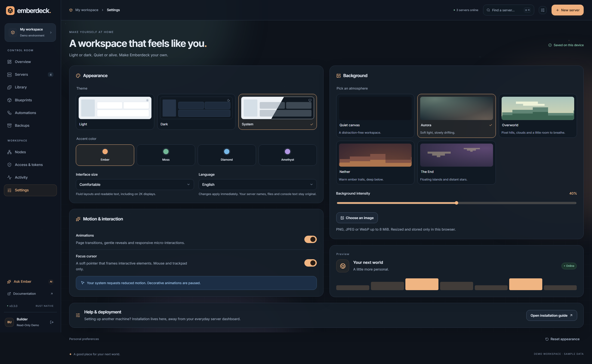
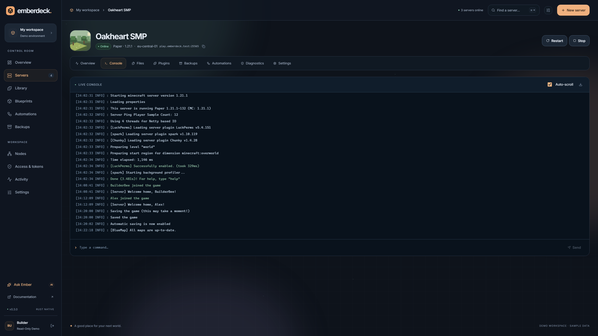

<div align="center">


# emberdeck.

**Your worlds, in good hands.**

A native, self-hosted Minecraft control plane.<br />
One Rust binary. An embedded web panel. A Linux agent. A real CLI.

[Live demo](https://hvhbigname.github.io/emberdeck/) · [Install wizard](https://hvhbigname.github.io/emberdeck/#/install) · [Documentation](docs/guide.md) · [Русский](docs/README.ru.md)

[](https://github.com/HVHBIGNAME/emberdeck/actions/workflows/ci.yml)
[](https://github.com/HVHBIGNAME/emberdeck/releases)
[](LICENSE)

</div>



<p align="center"><sub>A read-only demonstration with sample servers and metrics.</sub><br />
<a href="docs/media/walkthrough.mp4">Watch the short walkthrough ↗</a></p>

## Less admin. More Minecraft.

- **A world in a few clicks.** Paper, Purpur, Folia, Vanilla, Fabric, Forge, NeoForge, Quilt, and experimental Arclight blueprints. Published versions, automatic Java selection, and Modrinth modpacks.
- **A proper control room.** Start, stop, restart, console commands, MOTD, player counts, CPU / memory / disk observations, and metric history.
- **A workspace that feels like you.** Light, dark and system themes; English and Russian; adjustable text size; animated Minecraft backgrounds; keyboard-friendly selectors and an optional outline cursor. Motion can be switched off and respects your system's reduced-motion preference.
- **Files, your way.** A web editor with conflict detection, uploads and downloads, plus native, server-scoped SFTP. Toggle add-ons by renaming `.jar` ↔ `.jar.disabled`.
- **A library that knows your server.** Modrinth results filtered by game version and loader, required dependency resolution, publisher checksum verification, and GitHub release assets.
- **Automations with context.** Cron and interval schedules, player join / leave events, an empty-world trigger, exact-player filters, and “only when empty” conditions.
- **A save point when it matters.** Local compressed backups, SHA-256 verification, rollback-before-restore, and optional off-site copies through rclone — including Google Drive and S3.
- **A second pair of eyes.** Local log insights, bounded static JAR inspection, optional OSV dependency lookups, and isolated startup diagnosis with dependency-aware delta debugging.
- **An assistant with boundaries.** Bring an OpenAI-compatible provider. Ember can inspect logs, find compatible packages, and propose changes for your confirmation.

## Get started

Choose a profile in the [installation wizard](https://hvhbigname.github.io/emberdeck/#/install), copy one command and run it on your Linux host. For a quick HTTPS address without an account or inbound web ports:

```bash
curl -fsSL https://raw.githubusercontent.com/HVHBIGNAME/emberdeck/main/install.sh | sudo bash -s -- --access quick
```

The Ubuntu/Debian installer downloads a checksum-verified native release, installs Docker if needed, creates separate panel / agent services and configures Cloudflare Tunnel. **No Python, Node.js, database server, or Rust toolchain is needed at runtime.**

Open the HTTPS address printed by the installer. Retrieve your owner token in the same SSH session:

```bash
sudo cat /etc/emberdeck/owner-token
```

Quick URLs change when the tunnel restarts. For a stable address, use a Cloudflare connector token or managed Caddy on your own domain. Private SSH access and existing HTTPS proxies are also supported.

[Compare all five installation profiles →](docs/installation-profiles.md)



Choose **New server**, pick a blueprint, set its limits, and explicitly accept the [Minecraft EULA](https://www.minecraft.net/eula). First boot downloads the selected runtime and core.

For public access, multiple nodes, custom ports, or Google Drive, see the [installation guide](docs/guide.md).

### Prefer the terminal?

```bash
export EMBER_URL=http://127.0.0.1:8080
export EMBER_TOKEN='your-scoped-token'

emberdeck cli servers
emberdeck cli power SERVER_ID start
emberdeck cli logs SERVER_ID --tail 100
emberdeck cli command SERVER_ID 'say Hello, world!'
emberdeck cli backup SERVER_ID --destination local
```

`emberdeck cli api` exposes the complete JSON API. `--token-file` keeps credentials out of command arguments. See [API & CLI examples](docs/api.md).

Just exploring? Run **`emberdeck demo`** — a read-only sample workspace, without Docker or credentials. The panel and CLI can also be built on Windows; the server agent is Linux-first.

## Make yourself at home

Open **Settings** from the sidebar or the sliders button in the top bar. Appearance preferences apply immediately and are stored for this browser and panel address. The overview is the default entry point; installation help is under **Settings → Help & deployment**.



[Personalization guide →](docs/ui-preferences.md) · [Light theme](docs/media/overview-light.png) · [Русский интерфейс](docs/media/overview-ru.png)

## One binary, clear responsibilities

```text
Browser / CLI / future desktop client
                 │
          Emberdeck panel
       API · RBAC · SQLite · jobs
                 │ authenticated HTTP(S)
          Emberdeck agent(s)
       Docker · SFTP · files · backups
                 │
     Isolated Minecraft containers
```

The panel has no Docker socket. Each node has its own management token. Game containers run as a non-root user with dropped capabilities, a read-only root filesystem, per-server networking, and hard cgroup CPU / RAM limits. Disk budgets are monitored, **not filesystem quotas**.



## Where this release stands

**v0.3 is an early release.** The implemented paths are usable, but this is not a production-hardening claim.

Static findings are review signals, not an antivirus verdict. Isolated diagnosis covers reproducible **startup** failures; it never silently changes the original. An optional fix requires a healthy complementary trial, unchanged JAR hashes, and a backup. Player events currently use polling. Cloud backups and AI need your own provider configuration.

[Behavior, boundaries & threat model →](docs/architecture.md)

[Verification results and coverage →](docs/verification.md)

Next: a native desktop shell, an LXC backend, an in-game event / TPS bridge, resumable large transfers, and richer blueprint imports.

## Build & contribute

Build-time requirements: Rust **1.96+**, Node **22.12+**, npm.

```bash
npm ci
npm run build
cargo build --release --locked

cargo test --locked
cargo clippy --all-targets -- -D warnings
npx playwright install chromium
npm run test:e2e
```

The compiled UI is embedded into the Rust executable. Node is only a build / development dependency. See [CONTRIBUTING.md](CONTRIBUTING.md).

---

MIT · Built on [Axum](https://github.com/tokio-rs/axum), [Russh](https://github.com/warp-tech/russh), [itzg's Minecraft images](https://github.com/itzg/docker-minecraft-server), [Modrinth](https://modrinth.com), and the Minecraft server community.

<sub>Not an official Minecraft product. Not associated with Mojang or Microsoft.</sub>
