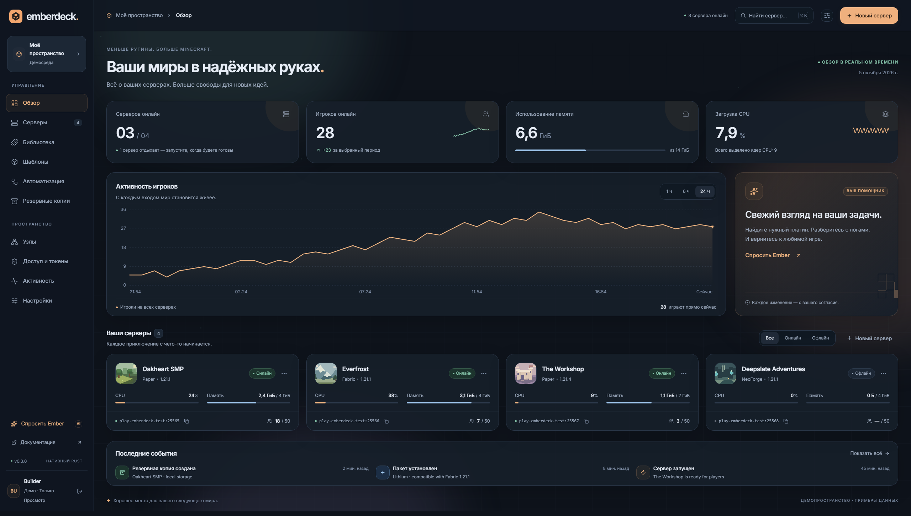
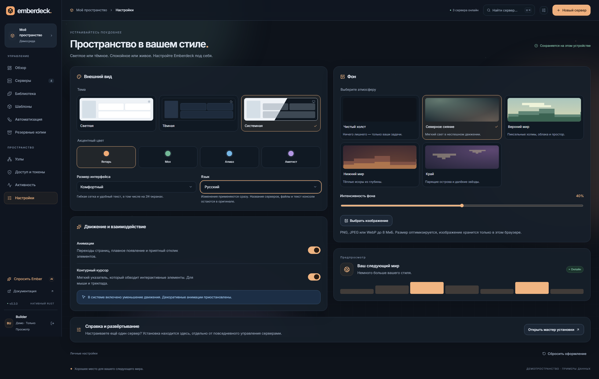

# Emberdeck

**Нативная панель управления Minecraft-серверами. Один бинарник на Rust.**

[Интерактивное демо](https://hvhbigname.github.io/emberdeck/) · [Видео](media/walkthrough.mp4) · [Релизы](https://github.com/HVHBIGNAME/emberdeck/releases)



На скриншотах и в публичном демо — явно обозначенные демонстрационные серверы и данные.

## Что уже есть

- Встроенная веб-панель, HTTP API, CLI и Linux-агент в одном исполняемом файле.
- Светлая, тёмная и системная темы, русский и английский интерфейс, три размера интерфейса, динамические Minecraft-фоны и своё изображение. Анимации и контурный курсор можно отключить.
- Мастер установки: пять способов подключения, выбор компонентов и портов, готовая команда для SSH. Находится в **Настройки → Справка и развёртывание** и доступен до входа.
- Docker-контейнеры с жёсткими лимитами CPU/RAM, непривилегированным пользователем и отдельными сетями. Диск — отслеживаемый бюджет, не файловая квота.
- Шаблоны Paper, Purpur, Folia, Vanilla, Fabric, Forge, NeoForge, Quilt и экспериментальный Arclight. Выбор опубликованных версий и автоматический выбор Java.
- Каталог Modrinth с фильтрацией по версии Minecraft и загрузчику, установка необходимых зависимостей, выбор GitHub-релизов, создание серверов из Modrinth-сборок.
- Консоль, команды, MOTD, онлайн и список игроков, история нагрузки, файловый редактор и SFTP с отдельными временными правами на каждый сервер.
- Включение/выключение модов и плагинов через `.jar` ↔ `.jar.disabled`; для применения нужен перезапуск JVM.
- Задачи по cron, интервалу, входу/выходу игроков, опустевшему серверу и конкретному нику.
- Локальные бэкапы, проверка SHA-256, резервная копия перед восстановлением и выгрузка через rclone, включая Google Drive/S3.
- Разбор типовых ошибок логов, статическая проверка JAR, опциональная проверка Maven-зависимостей по OSV.
- Поиск воспроизводимого сбоя запуска на отдельной копии сервера: проверка групп модов/плагинов с учётом известных жёстких зависимостей. Опциональное применение проверенного результата с предварительным бэкапом.
- ИИ-помощник с собственным OpenAI-совместимым провайдером. Может искать пакеты и предлагать изменения; установка и команды требуют подтверждения.

## Установка одной командой

На Ubuntu/Debian с systemd можно сразу получить временный HTTPS-адрес без домена и открытия входящих веб-портов:

```bash
curl -fsSL https://raw.githubusercontent.com/HVHBIGNAME/emberdeck/main/install.sh | sudo bash -s -- --access quick
```

Для работы не нужны Python, Node.js или Rust. Установщик скачивает готовый бинарник, проверяет SHA-256, при необходимости устанавливает Docker и создаёт службы `emberdeck-panel` / `emberdeck-agent`. Профиль `quick` также устанавливает проверенный `cloudflared`, запускает туннель отдельным непривилегированным пользователем и печатает проверенный HTTPS-адрес панели.

**Временный адрес меняется при перезапуске туннеля**, в том числе после перезагрузки хоста. Панель подхватывает новый адрес автоматически. Узнать текущий:

```bash
sudo emberdeck access inspect --field url
```

Открой напечатанный адрес. Главный токен для входа находится на сервере:

```bash
sudo cat /etc/emberdeck/owner-token
```

В мастере **Новый сервер** выбери ядро и версию, выставь ресурсы и явно прими Minecraft EULA. Первый запуск скачает ядро и Java-образ.

### Настроить внешний вид

Открой **Настройки** в боковой панели или кнопкой с ползунками сверху. Русский язык выбирается автоматически для русскоязычного браузера; его можно переключить вручную. Здесь же находятся тема, акцентный цвет, размер интерфейса, анимации, курсор и фон.

Настройки применяются сразу и сохраняются в этом браузере для текущего адреса панели. Изображение фона обрабатывается локально. Системный режим уменьшения движения отключает декоративные анимации и контурный курсор. Главная страница — обзор серверов.



[Подробнее о настройках](ui-preferences.md) · [Светлая тема](media/overview-light.png)

### Другие способы подключения

Выбрать параметры и скопировать готовую команду можно в [веб-мастере установки](https://hvhbigname.github.io/emberdeck/#/install).

| Профиль | Параметр | Что нужно |
| --- | --- | --- |
| Временный HTTPS | `--access quick` | Исходящее подключение к Cloudflare; домен и аккаунт не нужны |
| Постоянный Cloudflare Tunnel | `--access cloudflare --public-url https://panel.example.com` | Connector token и заранее настроенный публичный hostname в Cloudflare |
| Автоматический HTTPS через Caddy | `--access caddy --public-url https://panel.example.com` | DNS на сервер и свободные входящие порты 80/443 |
| Существующий reverse proxy | `--access proxy --public-url https://panel.example.com` | Уже настроенный HTTPS-прокси к loopback-адресу панели |
| Локальная панель | `--access local` | SSH forwarding |

Connector token Cloudflare вводится скрыто в терминале либо читается из файла через `--tunnel-token-file /root/cloudflared-token`. Он хранится отдельно от токена входа в Emberdeck. Привязку hostname к туннелю нужно настроить в Cloudflare заранее: токен подключения не даёт прав управления DNS.

Без `--access` новая установка остаётся локальной; обновление сохраняет текущий способ подключения. Для локального варианта выполни на своём компьютере `ssh -L 8080:127.0.0.1:8080 root@your-server` и открой **http://localhost:8080**.

`--mode all|panel|agent` выбирает компоненты, `--panel-port`, `--agent-port`, `--sftp-port` задают разные порты для новой установки. При обновлении существующие порты и токены сохраняются. Веб-туннель переносит панель/API; Minecraft и SFTP используют собственные адреса и порты узла.

Подробности и восстановление доступа — в [профилях установки](installation-profiles.md). Дополнительные узлы, Google Drive и настройка ИИ — в [руководстве](guide.md).

## CLI

```bash
export EMBER_URL=http://127.0.0.1:8080
export EMBER_TOKEN='your-scoped-token'
emberdeck cli servers
emberdeck cli power SERVER_ID start
emberdeck cli command SERVER_ID 'say Hello!'
emberdeck cli backup SERVER_ID
```

Для доступа ко всем операциям есть `emberdeck cli api`. Можно использовать `--token-file`, чтобы не передавать секрет в аргументах процесса. [Примеры API](api.md).

## Честные границы v0.3

Это ранний релиз. Статический анализ не гарантирует отсутствие вредоносного кода. Автодиагностика проверяет **сбои запуска**, не все возможные игровые ошибки. События игроков пока определяются опросом и могут пропустить очень короткие сессии. ИИ и облачные копии требуют настройки своего провайдера. SFTP-пароли имеют собственный срок действия, независимый от отзыва токена API.

В планах: LXC, полноценное desktop-приложение, игровой мост для точных событий/TPS и расширяемый импорт шаблонов. Windows поддерживается для панели/CLI/демо; серверный агент — Linux.

## Разработка

Rust 1.96+, Node 22.12+ нужны **только для сборки**:

```bash
npm ci
npm run build
cargo build --release --locked
cargo test --locked
npm run test:e2e
```

Веб-интерфейс встраивается в готовый исполняемый файл. Лицензия — MIT.
